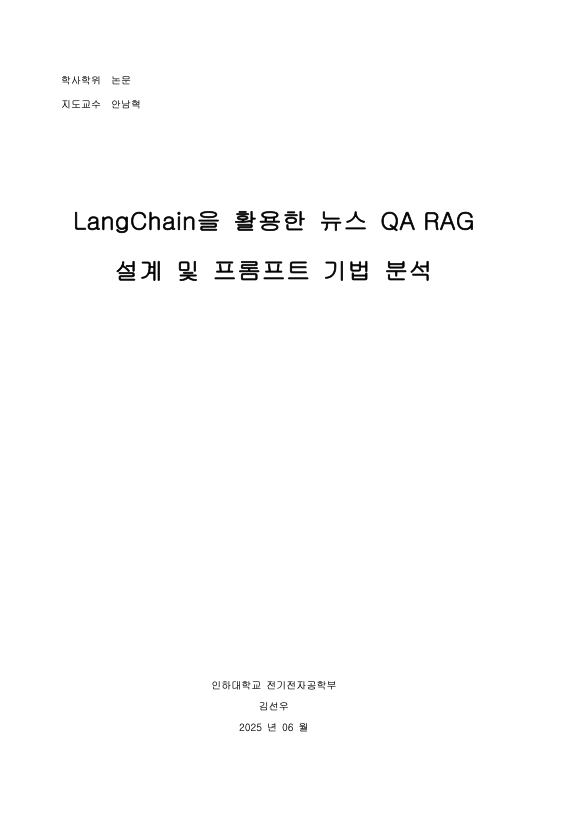
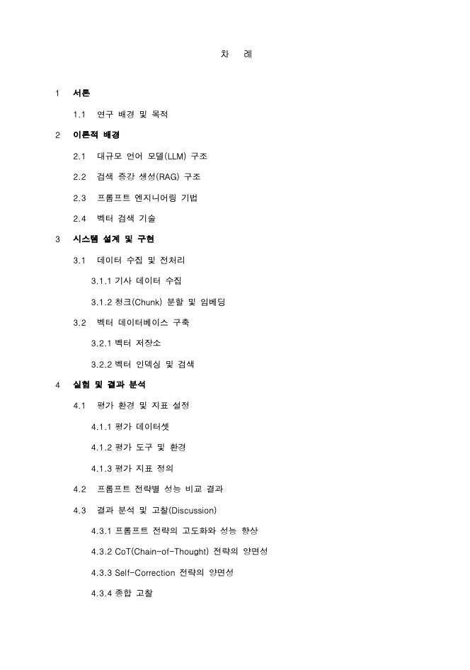

# 한국어 기술 뉴스 RAG 챗봇

Retrieval-Augmented Generation (RAG) 기반의 질의응답 챗봇입니다.
뉴스 정보 기반 RAG 챗봇 제작 및 프롬프트 기법 비교에 대한 논문 작성에 사용되었습니다.

<p align="left">
  
</p>
<p align="left">
  
</p>

## 주요 기술스택
- `LangChain`
- `Upstage Solar LLM`
- `Upstage Embeddings`
- `ChromaDB`

문서 검색과 생성 모델을 결합하기 위해 LangChain, Upstage Solar LLM, Upstage Embeddings, ChromaDB를 사용하며, LangSmith를 통해 실험/평가를 수행할 수 있습니다. 

본 저장소에는 Streamlit UI, 평가 스크립트, DB 점검/검증 유틸리티, 성능 비교용 그래프 생성 스크립트 등이 포함되어있습니다.

## 주요 특징 (Features)
- Streamlit UI 기반 챗봇: `ChatUpstage` + history-aware retrieval
- 벡터 데이터베이스: ChromaDB (HNSW, cosine)
- 프롬프트 전략: Basic, Few-shot, CoT, Self-Correction
- LangSmith 평가: `qa`, `context_qa` 내장 평가자 활용
- 유틸리티: DB 메트릭 산출, 의미론적 검색 검증, 그래프 생성

## 디렉터리 구조
```
src/
  rag_chatbot.py             # Streamlit 앱 (실행 진입점)
  evaluate_rag.py            # LangSmith 평가 실행 스크립트
  create_focused_graphs.py   # 논문용 그림 생성 스크립트
  get_db_metrics.py          # ChromaDB 지표 테이블 출력
  verify_semantic_search.py  # 의미론적 검색 검증
  langchain_crawler.py       # (선택) 원문 수집 및 ChromaDB 구축 파이프라인
  ... 기타 점검/스크래핑/보조 스크립트
chroma_db/                   # Chroma 영속 디렉터리 (gitignore 처리)
logs/                        # 로그 (gitignore)
output/                      # 산출물 (gitignore)
```

## 사전 준비 (Prerequisites)
- Python 3.10+
- Upstage API Key
- LangSmith API Key

## 설치 및 설정 (Setup)
```bash
# 1) 가상환경 생성 및 활성화
python -m venv venv
source venv/bin/activate  # macOS/Linux

# 2) 의존성 설치
pip install -r requirements.txt

# 3) 환경변수 파일 준비
# (예시를 보고 .env 생성 후 값 채우기)
```

`.env` 예시 (필요 키만 발췌):
```bash
UPSTAGE_API_KEY=your_upstage_api_key_here

LANGSMITH_API_KEY=your_langsmith_api_key_here
LANGSMITH_TRACING_V2=true
LANGSMITH_ENDPOINT=https://api.smith.langchain.com
LANGSMITH_PROJECT=it-news-rag-chatbot

# 선택: 경로 커스터마이즈
# CHROMA_DB_DIR=./chroma_db
```

- 코드에서 `load_dotenv(override=True)`로 `.env`가 셸 환경변수보다 우선하도록 처리되어 있습니다.
- LangSmith 계정이 EU 리전에 없다면 `LANGSMITH_ENDPOINT`는 위 기본값(`https://api.smith.langchain.com`)을 사용하세요.

## 실행 (Streamlit)
```bash
streamlit run src/rag_chatbot.py
```
- UI에서 프롬프트 전략을 선택할 수 있습니다.
- 기본 ChromaDB 경로는 `./chroma_db`입니다. (존재하지 않으면 먼저 구축 또는 경로 조정)

## ChromaDB 구축/갱신 (선택)
원문 수집 및 임베딩 후 인덱스를 구성하려면, 파이프라인을 환경에 맞게 조정한 뒤 실행하세요.
```bash
python src/langchain_crawler.py
```
- 기본 영속 경로는 `./chroma_db`입니다.

## LangSmith 평가 (Evaluation)
LangSmith에서 데이터셋 이름을 `it-news-rag-chatbot`으로 준비하고, 다음 필드를 사용하세요.
- `input`: 질문
- `output.answer`: 정답(참조) 텍스트
- (선택) `output.context`: 참조 문맥

평가 실행:
```bash
python src/evaluate_rag.py
```
- 프롬프트별 실험이 수행되며, 내장 평가자 `qa`(정답 일치), `context_qa`(문맥 타당성)를 사용합니다.
- LangSmith UI에서는 메타데이터 `prompt_name`으로 필터링하여 프롬프트 전략별 결과를 비교할 수 있습니다.

## 문제 해결 (Troubleshooting)
- LangSmith 403: `.env`가 올바르게 로드되는지 확인하고, 셸에 충돌하는 `LANGSMITH_*` 변수가 남아있지 않은지 점검하세요. 리전이 EU가 아니면 `LANGSMITH_ENDPOINT=https://api.smith.langchain.com`을 사용합니다.
- `RunEvalConfig` 관련 ImportError: 본 저장소는 최신 `evaluate(...)` API와 `LangChainStringEvaluator`를 사용하므로 `requirements.txt` 버전과 함께 동작합니다.
- Chroma 입력 타입 오류/차원 오류: 리트리버에는 문자열 쿼리가 들어가야 합니다. 제공된 체인 구성은 해당 입력 형태를 보장합니다.